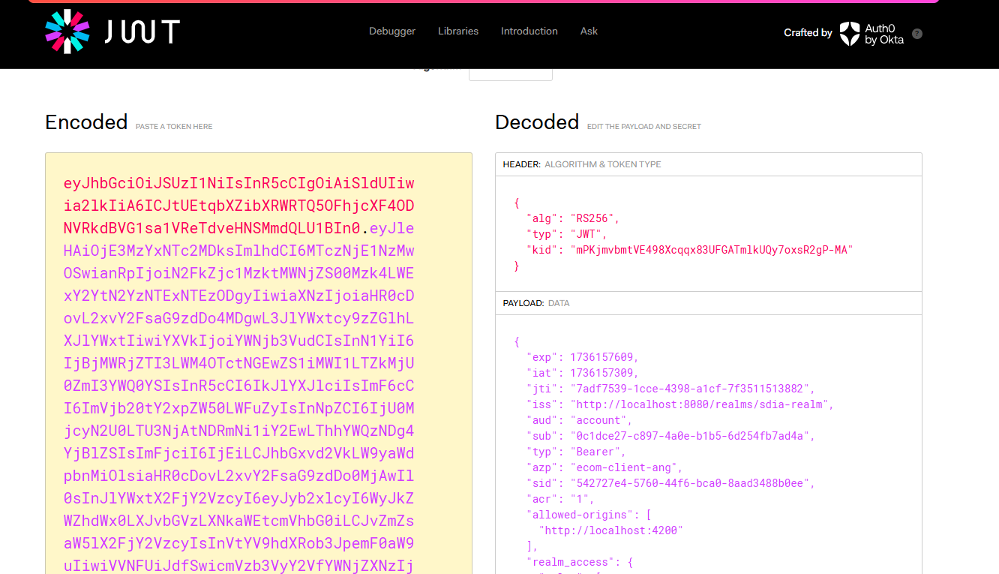

# EL HOU Salima SDIA 2

# Système Distribué de Certification Électronique de Chèques

Ce projet implémente un système distribué permettant de certifier électroniquement des chèques via des microservices. Le système interagit avec plusieurs services pour valider les informations des chèques, vérifier les soldes des comptes bancaires, et certifier les chèques à l'aide de Kafka pour la gestion des événements.

## Architecture du Projet

L'architecture comprend les microservices suivants :
- **Commercant-Service** : Gère les informations sur les chèques.
- **Banque-Centrale-Service** : Gère les agences bancaires et leur interaction avec les autres services.
- **Agence-Bancaire-Service** : Gère les comptes bancaires et les opérations comme le débit, crédit et certification de chèques.
- **Authentication-Service** : Service d'authentification basé sur OAuth2 et OpenID Connect via Keycloak.
- **Broker KAFKA** : Gère la messagerie asynchrone entre les services.
- **Data Analytics Service** : Consomme les messages publiés dans les topics Kafka pour effectuer une analyse des événements.

## Technologies Utilisées

- **Spring Cloud** : Pour la gestion des microservices et des services comme Eureka (Discovery), Config Server, et API Gateway.
- **Kafka** : Pour gérer les messages d'audit et l'événementiel entre les microservices.
- **Spring Boot** : Pour le développement des microservices.
- **Keycloak** : Pour l'authentification et la gestion des rôles avec OAuth2.
- **Docker et Docker Compose** : Pour le déploiement de l'application dans des conteneurs.
- **H2 Database** : Base de données utilisée pour les tests locaux.


---

## Partie 1 : Configuration de Keycloak

### Étapes pour configurer Keycloak :

1. **Démarrer Keycloak**
    - Commande pour démarrer Keycloak (mode développement) :
      ```bash
       docker run -p 8080:8080 -e KC_BOOTSTRAP_ADMIN_USERNAME=admin -e KC_BOOTSTRAP_ADMIN_PASSWORD=admin quay.io/keycloak/keycloak:26.0.7 start-dev
      ```

2. **Créer un compte Admin**
    - Accédez à **http://localhost:8080** et suivez les étapes pour créer un compte administrateur.
    - 
3. **Créer une Realm**
    - Créez une nouvelle Realm nommée `realm-sdia`.


4. **Créer un client sécurisé**
    - Exemple de client : `ecom-client-ang` avec accès public ou confidentiel.

   
5. **Créer des utilisateurs**
    - Ajoutez des utilisateurs avec des informations de base (username, email, etc.).


6. **Créer et attribuer des rôles**
    - Exemple de rôles : `ADMIN`, `USER`.
    - Affectez ces rôles aux utilisateurs.

---

## Exécution des tests avec Swagger

### Tester l'authentification avec les JWT
1. **Récupération d'un Access Token avec mot de passe** :
    - Méthode : **POST**
    - URL : `http://localhost:8080/realms/sdia-realm/protocol/openid-connect/token`
    - Paramètres requis :
      ```json
      {
        "grant_type": "password",
        "client_id": "micro-service-client",
        "username": "user1",
        "password": "mypassword"
      }
      ```

**Test Cheques :**   


**Test Banque Centrale :**


**Test Agence Bancaire :**


2. **Analyser Access Token et Refresh Token**
    - Utilisez des outils comme [jwt.io](https://jwt.io/) pour décoder les tokens.
   



---

## Partie 2 : Développement et sécurisation de l'architecture Micro-Service

### Étapes de développement :
1. **Backend : Spring Boot**
    - Configurez un serveur Spring Boot avec sécurité Keycloak. 

2. **Frontend : Angular**
    - Implémentez l'authentification via Keycloak dans Angular.
    - Utilisez la bibliothèque **keycloak-js** pour intégrer Keycloak.


**Commercant-Service :**

**H2 Database :**


**Commercant interface :**


**Banque-Centrale-Service :**

**H2 Database :**


**Banque Centrale interface :**


**Agence-Bancaires-Service :**

**H2 Database :**


**Agence Bancaires interface :**


---


---

## Auteur

- **EL HOU Salima**
- **[LinkedIn](https://www.linkedin.com/in/salima-el-hou-883294235/)**

---

